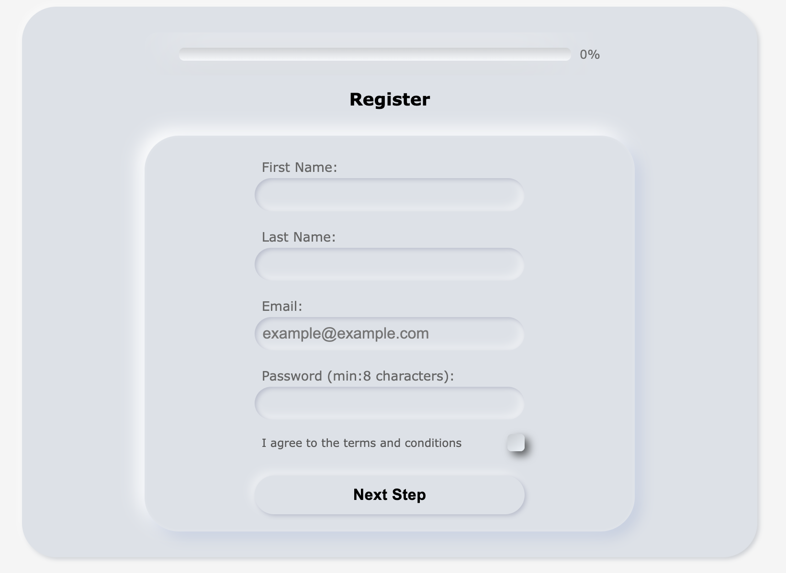
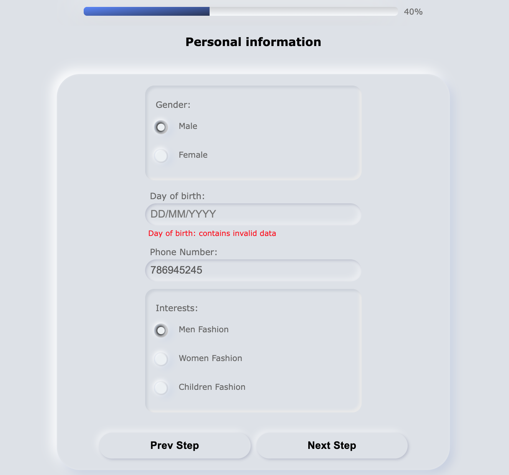
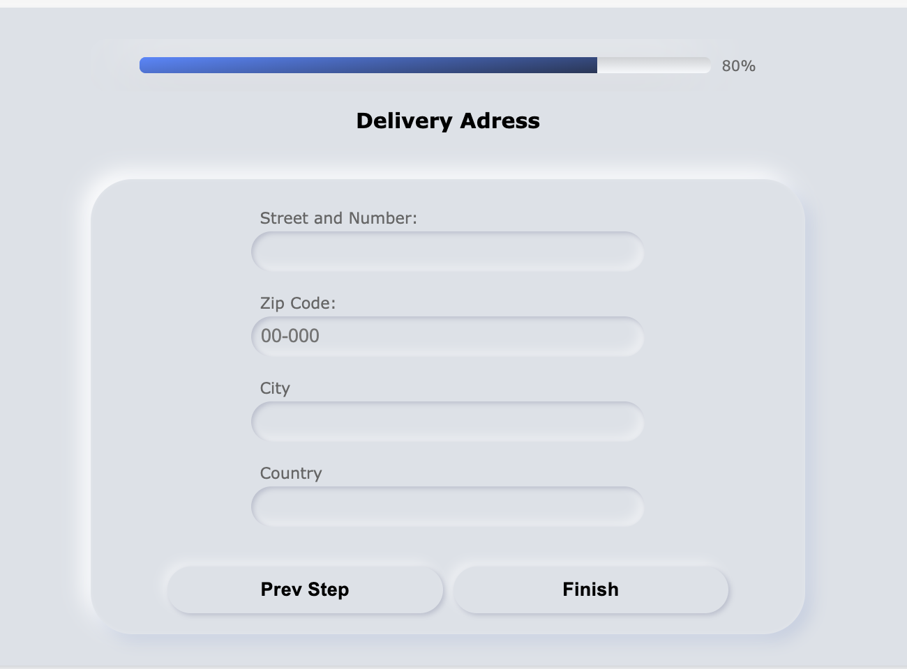

# Multi Step Form - React

## Table of Contents
1. [About the project](#about-the-project)
2. [How to see it](#how-to-see-it)
3. [Technologies](#technologies)
4. [Solutions](#solutions)
5. [Development](#development)
6. [Project preview](#project-preview)
7. [Contact](#feel-free-to-contact-me)
8. [Sources](#sources)
9. [Thanks](#thanks-for-project-and-support-to-Mateusz-Bogolubow)

## About the project
The aim of the project was to create multi step form with some styling added to it by using Styled Components. Design part is based on Neumorphism style. When creating this form, I focused on writing a small components, which I can use to build my application and later to use them in another future projects - reusable code.

My form contains 3 steps which simulate registering to the shop. Each step is in a separated files and inputs are created based on a JSON file. Additionally, I have used information from those files to check data in the form. Functions and state are transferred to another component using props.

My form contains elements like:
* inputs type: text, number
* inputs radio
* input checkbox
* buttons
* progress bar

The form’s data is checked in two place:
* when user clicked button "Next Step",
* when user left active input - user see the error (if exist) immediately

User can go to next step if all required data are correct. My purpose was to limit as possible using if..else statement, so I used data from JSON file such as: required: true and pattern to check data.

```
if(input.required){
            if(value.length === 0){
                errors[input.name]= `${input.label} is required `
            }
        }
        if(input.pattern){
            const reg = new RegExp(input.pattern);
            if(!reg.test(value)){
                errors[input.name] = `${input.label} contains invalid data`
            }
        }
```


## How to use it
Download the data, clone my project
```
git clone <url>
```

Type into the terminal
```
npm i
```

Next, to run, type into the terminal:
```
npm start
```

## Technologies:
* JavaScript
* React
* Styled Components
* HTML
* CSS
* Desktop only version


## Solutions
When creating this project I had an opportunity to practice/learn:
* using Styled Components
* how to style inputs like radio and checkbox
* how to style progress bar to work on each browser in a correct way
* creating inputs elements based on data in JSON file
* another way to check if data in inputs is correct before sending the form
* to build reusable code by splitting it in a small chunks
* using enum object


### Project preview
Step one


Step two


Step three



### Feel free to contact me:
* [Linkedin](https://www.linkedin.com/in/ewelina-kopacz-929559100/) - Ewelina Kopacz


### Sources:
* [Devmentor](https://devmentor.pl/b/mniej-instrukcji-warunkowych)
* [Devmentor](https://devmentor.pl/b/walidacja-formularza-w-javascript)
* [Nikita Hlopov](https://nikitahl.com/progress-bar-css)
* [Neumorphism](https://neumorphism.io/#1251af)

### Thanks for project and support to Mateusz Bogolubow:
* Mentor i Trener Programowania JavaScript - [DevMentor](https://devmentor.pl/) - Mateusz Bogolubow